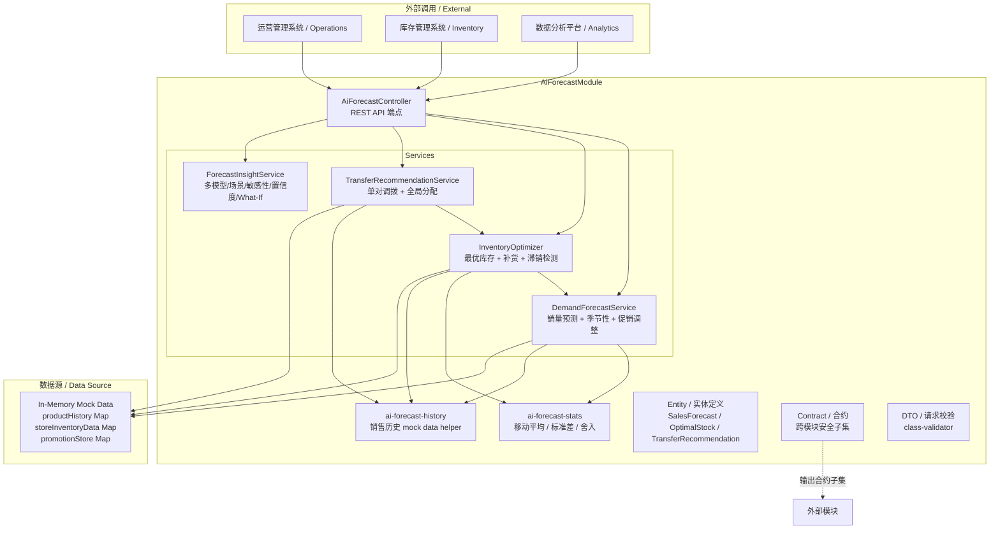

# AI 需求预测模块 / AI Demand Forecast Module

## 模块概述 / Module Overview

AI 需求预测模块提供**销量预测、库存优化、调拨管理**三大核心能力。基于历史销售数据（30 天滑动窗口）进行移动平均 + 季节性因子分析，输出单品和品类级别的销量预测，并在此基础上推导最优库存配置、补货建议、滞销品检测及跨门店调拨方案。

**业务定位 / Business Role**：运营和供应链管理人员的决策支持工具 — 预测未来销量、优化库存水位、智能调拨库存以降低缺货/积压风险。

---

## 核心功能 / Core Features

| 功能 | 说明 |
|------|------|
| 单产品销量预测    | 基于移动平均 + 季节性因子 + 趋势的销量预测 |
| 品类销量预测      | 聚合品类下所有产品的预测结果 |
| 季节性因子计算    | 12 个月的月度因子，考量历史 baseline |
| 促销调整          | 基于活动的促销影响修正预测值 |
| 最优库存计算      | 安全库存 + 周期库存 + 再订货点 |
| 补货建议          | 基于安全库存线和再订货点的自动补货提醒 |
| 滞销品检测        | 距上次销售天数/周转率分析 |
| 单对门店调拨建议  | 基于库存差异的调拨量计算与净收益 |
| 调拨收益计算      | 运费/损耗/人力成本 vs 缺货/持有节省 |
| 全局最优分配      | 多门店-多产品的智能调拨方案 |
| 多模型对比        | ARIMA/Prophet/LightGBM/LSTM/Ensemble 预测精度对比 |
| 场景模拟          | 乐观/基准/悲观/极端场景的预测模拟 |
| 敏感性分析        | 客单价/客户数/转化率等因素的弹性分析 |
| 置信度评估        | 数据质量/模型置信度/波动性综合评分 |
| 库存 SKU 级建议   | 单品库存缺货/积压风险评估 |
| 时间序列分解      | 趋势/季节/残差分量分解 |
| What-If 分析      | 变量调整对预测的影响模拟 |
| 需求塑形          | 价格弹性/促销影响/价格-销量曲线 |

---

## 架构图 / Architecture Diagram



---

## API 端点 / API Endpoints

### 销量预测 / Sales Forecast

| 方法 | 路径 | 说明 |
|------|------|------|
| GET  | `/ai-forecast/forecast/sales`              | 单产品销量预测 |
| GET  | `/ai-forecast/forecast/category`           | 品类销量预测 |
| GET  | `/ai-forecast/seasonality`                 | 获取季节性因子 |
| POST | `/ai-forecast/forecast/adjust-promotions`  | 促销调整后的预测 |

### 库存优化 / Inventory Optimization

| 方法 | 路径 | 说明 |
|------|------|------|
| GET  | `/ai-forecast/inventory/optimal-stock` | 计算最优库存 |
| GET  | `/ai-forecast/inventory/reorder`       | 补货建议 |
| GET  | `/ai-forecast/inventory/slow-moving`   | 滞销品检测 |

### 调拨管理 / Transfer Management

| 方法 | 路径 | 说明 |
|------|------|------|
| GET  | `/ai-forecast/transfer/suggest`           | 单对门店调拨建议 |
| GET  | `/ai-forecast/transfer/benefit`           | 调拨收益计算 |
| POST | `/ai-forecast/transfer/optimize-global`   | 全局最优分配 |

---

## 配置说明 / Configuration

本模块基于**内存模拟数据**运行，适合开发/测试/演示。生产环境需接入真实销售历史数据库。

| 配置项 | 类型 | 默认值 | 说明 |
|--------|------|--------|------|
| `TENANT_GUARD` | 中间件 | 启用 | 租户隔离守卫 |
| `ValidationPipe` | 管道 | whitelist + transform | DTO 输入校验 |
| `productHistory` | Map | 30天模拟数据 | 产品历史销量 |
| `storeInventoryData` | Map | 按需初始化 | 门店库存数据 |
| `promotionStore` | Map | 空 | 促销活动数据 |

---

## 依赖关系 / Dependencies

| 依赖模块 | 方向 | 说明 |
|----------|------|------|
| `@nestjs/common` | 框架 | NestJS 核心 |
| `class-validator / class-transformer` | 外部 | DTO 校验与转换 |
| `../agent/tenant.guard` | 内部 | 租户隔离守卫 |
| `ai-forecast-stats.ts` | 模块内 | 移动平均/标准差/舍入纯函数 |
| `ai-forecast-history.ts` | 模块内 | 销售历史 mock 数据 helper |

**跨模块合约消费方 / Contract Consumers**：
- `inventory` — 库存管理
- `analytics` — 分析平台
- `recommender` — 推荐系统

---

## 核心算法 / Core Algorithms

### 销量预测 / Sales Forecast

```
predictedSales = movingAverage(7天) × daysAhead × 季节性因子 × 趋势因子
```

- **移动平均**: 7 天滑动窗口
- **季节性因子**: 基于 hashCode 生成 12 个月因子
- **趋势因子**: `1 + (trend / 100) × (daysAhead / 30)`

### 最优库存 / Optimal Stock

```
安全库存   = Z(1.65) × stdDev(14天) × √leadTime
周期库存   = dailyAvg × leadTime
再订货点   = 安全库存 + 周期库存
再订货数量 = 周期库存 + 安全库存
```

### 调拨收益 / Transfer Benefit

```
净收益 = 缺货避免节省 + 持有成本节省 - (运费 + 损耗 + 人力)
```

---

## 实体类型 / Entity Types

| 实体 | 说明 | 关键字段 |
|------|------|----------|
| SalesForecast | 销量预测结果 | productId, predictedSales, confidence, seasonalityFactor |
| CategoryForecast | 品类预测 | categoryId, totalPredictedSales, productForecasts[] |
| SeasonalityFactor | 季节性因子 | productId, monthlyFactors[12], trend |
| OptimalStock | 最优库存 | safetyStock, cycleStock, reorderPoint |
| ReorderSuggestion | 补货建议 | suggestedQuantity, urgency, reason |
| SlowMovingProduct | 滞销品 | daysSinceLastSale, turnoverRate, recommendation |
| StoreInventory | 门店库存 | currentStock, dailySales, leadTimeDays |
| TransferRecommendation | 调拨建议 | fromStore, toStore, quantity, netBenefit |
| GlobalAllocation | 全局分配 | allocations[], totalBenefit |

---

## 测试 / Testing

模块测试覆盖：
- **单元测试** — service 层预测/库存/调拨
- **进阶测试** — forecast-insight 多模型/场景/敏感性
- **契约测试** — contract 映射器转换
- **历史测试** — history helper 边界
- **统计测试** — 移动平均/标准差纯函数
- **诊断测试** — 诊断集成
- **E2E 测试** — 全链路端点测试
- **角色测试** — 多角色权限场景
- **压力测试** — 高并发场景
- **RingBeam 测试** — 圈梁集成测试
