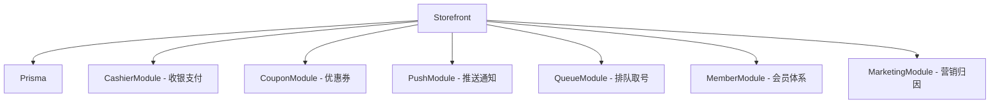

# Storefront — TOC 单店 C 端聚合模块

## 用途概述

Storefront 是神机营系统的 **C 端单店聚合入口**，面向普通消费者提供门店信息浏览、服务预约、改期取消、到店核销、在线支付、排队取号、优惠券匹配、全员营销与 KOL 推广追踪等能力。

**Phase:** 2B 社媒增长引擎  
**设计原则:** 不重复造轮子 — 聚合已有系统能力，新增 TOC 专属逻辑

## 文件结构

```
storefront/
├── dto/
│   ├── create-booking.dto.ts     # 创建预约 DTO（class-validator 校验）
│   └── cancellation.dto.ts       # 取消/改期 DTO
├── storefront.module.ts          # NestJS 模块声明（聚合 7 个已有模块）
├── storefront.controller.ts      # 17 个 REST API 端点
├── storefront.service.ts         # 门店业务逻辑（Prisma 持久化）
├── referral-tracking.service.ts   # 全员营销 & KOL 推广追踪引擎
├── storefront-reminder.service.ts # 到店提醒心跳服务（T-2h / T-30min）
└── storefront.controller.metadata.test.ts  # 路由元数据测试
```

## 核心数据模型

### Prisma 模型：`StorefrontBooking`

| 字段 | 类型 | 说明 |
|------|------|------|
| `bookingId` | `String @id` | 预约 ID（唯一主键） |
| `tenantId` | `String` | 租户隔离 |
| `storeSlug` | `String` | 门店标识 |
| `serviceId` | `String` | 服务项目 ID |
| `serviceName` | `String` | 服务名称 |
| `date` | `String` | 预约日期 |
| `timeSlot` | `String` | 时段（HH:00/HH:30） |
| `customerName` | `String` | 客户姓名 |
| `customerPhone` | `String` | 手机号 |
| `status` | `String` | 状态：confirmed / cancelled / rescheduled / completed |
| `qrCode` / `qrSignature` | `String` | QR 核销码 / HMAC 签名 |
| `amount` | `Int` | 实际支付金额（分） |
| `couponCode` | `String?` | 优惠券码 |
| `paymentUrl` | `String?` | 支付链接 |
| `cancelledAt` / `rescheduledTo` | `DateTime?` / `Json?` | 取消/改期记录 |
| `@@unique([date, timeSlot, serviceId])` | — | DB 级并发防超卖约束 |

### Prisma 模型：`StorefrontReferralCode`

| 字段 | 说明 |
|------|------|
| `code` | 推广码（唯一） |
| `type` | employee / kol / customer |
| `referrerId` | 推广人 ID |
| `referrerName` | 推广人名称 |
| `storeSlug` | 所属门店 |
| `channel` | 渠道（wechat / douyin / xiaohongshu / weibo / bilibili） |
| `totalScans` / `totalConversions` / `totalCommission` | 统计字段 |

### Prisma 模型：`StorefrontReferralRelation`

扫码追踪 + 转化归因，支持「已转化」防重复归因。

## API 接口（17 个端点）

| 分组 | 方法 | 路径 | 说明 |
|------|------|------|------|
| **门店** | GET | `store/:slug` | 门店信息 |
| | GET | `store/:slug/services` | 服务列表（可选 category 筛选） |
| | GET | `store/:slug/services/:id/slots` | 时段查询（DB 级并发安全） |
| **预约** | POST | `bookings` | 创建预约（含 QR 签名） |
| | GET | `bookings/:bookingId` | 查询预约 |
| | POST | `bookings/:bookingId/cancel` | 取消预约（T-1h 限制） |
| | POST | `bookings/:bookingId/reschedule` | 改期（DB 唯一约束防冲突） |
| | POST | `bookings/:bookingId/checkin` | 核销（HMAC 签名验证） |
| **优惠券** | POST | `coupons/match` | 匹配可用优惠券（→ coupon/ 模块） |
| **套餐** | GET | `packages` | 套餐列表 |
| **支付** | POST | `payments/create` | 创建预支付（→ cashier/ 模块） |
| **排队** | POST | `queue/join` | 加入排队（→ queue/ 模块） |
| | GET | `queue/status/:resourceId` | 排队状态 |
| **全员营销** | POST | `referral/create-code` | 创建推广码 |
| | POST | `referral/scan` | 扫码归因 |
| | POST | `referral/conversion` | 转化追踪 |
| | GET | `referral/leaderboard/:storeSlug` | 排行榜 |
| | GET | `referral/dashboard/:referrerId` | 推广者面板 |
| | POST | `referral/kol-link` | 达人专属链接 |
| | POST | `referral/remove-relationship` | 解除推广关系 |

## 依赖关系



所有子模块已在 `storefront.module.ts` 中通过 `imports` 注入。

## 使用示例

### 示例 1：创建预约

```typescript
// POST /api/storefront/bookings
{
  "storeSlug": "beijing-chaoyang",
  "serviceId": "svc-001",
  "date": "2026-07-28",
  "timeSlot": "14:00",
  "customerName": "张三",
  "customerPhone": "13800138000",
  "couponCode": "WELCOME50"   // 可选
}

// 响应
{
  "success": true,
  "data": {
    "bookingId": "BK-1722000000-abcd1234",
    "status": "confirmed",
    "qrCode": "QR:BK-1722000000-abcd1234:abc123def456",
    "qrSignature": "abc123def456",
    "paymentUrl": "https://pay.shenjiying.com/order/BK-1722000000-abcd1234",
    "storeName": "神机营·北京朝阳店",
    "serviceName": "标准电竞台（2小时）",
    "date": "2026-07-28",
    "timeSlot": "14:00",
    "customerName": "张三",
    "amount": 1900
  }
}
```

### 示例 2：全员营销推广追踪

```typescript
// 1. 创建 KOL 推广链接
// POST /api/storefront/referral/kol-link
{
  "kolId": "KOL003",
  "kolName": "@游戏达人老王(抖音80w粉)",
  "platform": "douyin",
  "storeSlug": "beijing-chaoyang"
}

// 响应
{
  "success": true,
  "data": {
    "kolId": "KOL003",
    "referralCode": "REF-KOL-KOL003-xyz789",
    "trackingUrl": "https://beijing-chaoyang.shenjiying.com?ref=REF-KOL-KOL003-xyz789"
  }
}

// 2. 客户扫码归因（无感追踪）
// POST /api/storefront/referral/scan
{
  "code": "REF-KOL-KOL003-xyz789",
  "customerPhone": "13900139000"
}

// 3. 客户消费后自动转化归因
// POST /api/storefront/referral/conversion
{
  "customerPhone": "13900139000",
  "orderAmount": 12900  // 金额以分为单位
}
// → KOL 获得阶梯佣金，客户享受新人优惠
```

## 测试命令

```bash
# 在 apps/api 目录下执行
# 运行当前模块所有测试
npx vitest run --reporter=verbose src/modules/storefront/

# 仅运行路由元数据测试
npx vitest run src/modules/storefront/storefront.controller.metadata.test.ts

# 带 watch 模式
npx vitest src/modules/storefront/
```

## 关键设计决策

1. **并发防超卖**：`@@unique([date, timeSlot, serviceId])` 数据库唯一约束，P2002 异常转 `ConflictException`
2. **安全防线**：QR 核销码使用 `HMAC-SHA256(bookingId + secret)` 签名，防止 QR 码遍历伪造
3. **推广归因透明**：扫码无感记录，不向被推广客户发送骚扰通知，宪法§13.8
4. **佣金阶梯制**：销售额 ¥0→10万 抽 3%，¥10万→50万 抽 5%，¥50万→200万 抽 8%，¥200万+ 抽 12%（宪法§13.5）
5. **到店提醒**：基于 `setInterval` 心跳，T-2h 和 T-30min 两次推送

## 维护者

- **维护者:** 神机营 API 团队
- **最后修改:** 2026-07-26

## 交叉引用

- [API 主模块](../../README.md) — API 应用入口
- [Coupon 模块](../coupon/README.md) — 优惠券管理
- [Queue 模块](../queue/README.md) — 排队取号
- [Cashier 模块](../cashier/README.md) — 收银支付
- [Prisma Schema](../../prisma/schema.prisma) — 数据库模型定义
