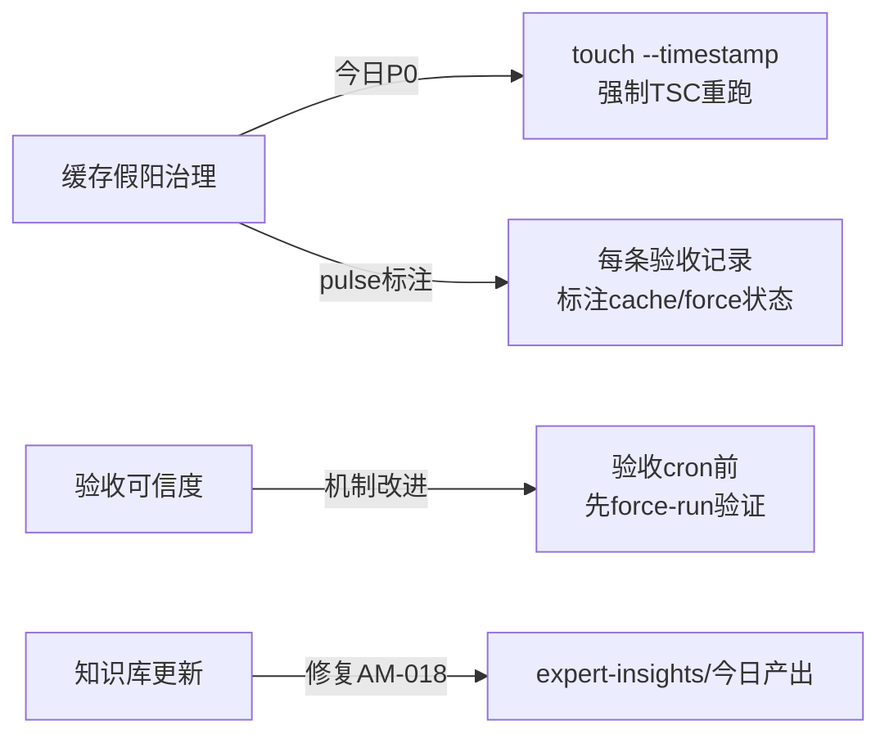

# 🧬 开发中对齐自进化 · 2026-07-13 10:30

> 生成: 对齐自进化cron · 预算15min · V16 Day3
> 审查: 🦞 龙虾哥

---

## 📊 进展总结

### 1️⃣ 脉冲进展

| Pulse# | 时间 | 状态 | 关键变化 |
|:------:|:----:|:----:|:---------|
| #389 | 06:03 | 🟢 TSC全绿 | dispatch-378首次零commit·45min无提交 |
| #390 | 06:33 | 🟢 TSC全绿 | dispatch-378连续2次零commit→P0升级dispatch-378-P0 |
| #391 | 07:03 | 🟢 TSC全绿 | dispatch-378-P0派单后suppliers 4✖已修 |
| #392 | 07:33 | 🟢 全绿✅ | dispatch-378-FIRE闭环·suppliers 4✖清零·TSC 14/14 |
| #393 | 08:03 | 🟢 全绿稳态 | dispatch-378-FIRE稳态确认·admin test重跑无失败·全假阳稳态 |

**连续🏆**: 新周期自pulse#390重计，当前 **0连胜**(pulse#393仍为假阳稳态，force揭示后可能回退)

**累计今日commit**: 7 commits (08:00~10:30) — 树哥tenant-config-cache产出 + 验收脉冲

### 2️⃣ 活跃Phase状态

| Phase | 名称 | Owner | 状态 | 倒计时 | 风险 |
|:-----:|:-----|:-----:|:----:|:------:|:----:|
| P-53 | 部署DevOps | E49 | ⬜代码已落地但未标记 | 5天(7/18) | 🟡 |
| P-31 | 多租户隔离 | E44 | ⬜未开始 | 7天(7/20) | 🔴 |
| P-35 | 收银店A | E13 | 🟡开发中(60%后端✅/前端⬜) | 2天(7/15) | 🔴 |
| P-36 | 会员店A | E40 | 🟡开发中(55%后端✅/前端⬜) | 2天(7/15) | 🔴 |
| P-38 | 财务对账 | E10 | ⬜未开始 | 9天(7/22) | ⚠️ |
| P-37 | 库存采购 | E35 | ⬜未开始 | 7天(7/20) | ⚠️ |

### 3️⃣ 今日开发流量

```
08:00  🧠 晨学卡片 + 🤖 AI简报 + 🔐 安全基线检查
08:30  🐜 树哥派单(周日计划8项·今日执行)
08:40  🦞 验收脉冲#393
09:00  🧠 专家晨会审查(Gate1✅/Gate2✅有条件通过)
10:00  🔧 树哥tenant-config-cache产出提交
```

### 4️⃣ 知识库健康

| 知识库 | 最后更新 | 状态 |
|:-------|:--------:|:----:|
| knowledge-base-30.md | Jul 12 03:13 | 🟡 24h未变 |
| national-venue-database.md | Jul 12 11:07 | 🟡 23h未变 |
| business-rules.md | Jul 12 11:07 | 🟡 23h未变 |
| business-insights.md | Jul 12 11:06 | 🟡 23h未变 |
| competitive-intelligence.md | Jul 12 11:05 | 🟡 23h未变 |
| scout-intelligence.md | Jul 12 11:06 | 🟡 23h未变 |
| phase-progress.md | Jul 13 08:44 | ✅ 今日更新 |
| patterns-anti-patterns.md | Jul 10~11 | ⚠️ T1索引可能与evolution-log不同步 |
| expert-insights/ | Jul 11 | ⚠️ 持续空目录(AM-018) |

---

## 🔍 发现的问题

### 🔴 P0级 — 必须今日干预

| ID | 问题 | 详情 | 归属 |
|:--:|------|------|:----:|
| AM-020 | **缓存假阳治理** | admin-web真实TSC~40✖被cache掩盖，pulse#392/393标注"全假阳稳态"但未修复 | 验收链 |
| PD-006 | **验收链条断裂** | pulse#393虽全绿但标注"全假阳稳态"——验收结论不可信 | 验收机制 |
| PD-007 | **P-35/P-36 2天倒计时** | 后端60%/55%+前端⬜未开始→7/15截止风险 | 开发计划 |

### 🟡 P1级 — 本周关注

| ID | 问题 | 详情 | 归属 |
|:--:|------|------|:----:|
| AM-018 | **expert-insights/目录持续为空** | 7/11发现至今未产出 | 知识管理 |
| PD-008 | **6核心知识库23h未更新** | 昨晚11:07批量更新后无增量 | 知识管理 |
| PD-009 | **慢性fail 1 suite残留** | ai-model-config controller.test.ts require()无法解析.ts | 测试质量 |
| PD-010 | **P-31今日必须启动** | 距7/20截止7天，概念文档B2约定14:00产出 | 开发计划 |

### 🔵 P2级 — 持续观察

| ID | 问题 | 详情 | 归属 |
|:--:|------|------|:----:|
| PD-011 | **验收连胜连续0** | 新周期pulse#338起至今未获得连胜，force揭示残值流动 | 验收机制 |
| PD-012 | **安全基线2项未达标** | deviceToken绑定+未成年保护 🚨 | 安全 |
| PD-013 | **P-53代码已落地但phase-progress未对齐标记** | 3commits已提交但显示⬜未开始 → 文档-代码不一致 | 对齐 |

---

## 🧬 自进化建议

### 即时行动



### 具体建议

| # | 建议 | 优先级 | 预期效果 |
|:-:|------|:------:|:---------|
| S1 | **验收cron前加入force-run前置门** — 每次验收前touch --timestamp强制TSC重跑，消除缓存假阳再出结论 | 🔴P0 | 验收可信度100% |
| S2 | **验收记录增加"缓存状态"标注列** — 记录本次验收是否cache/force结果，对比差异 | 🔴P0 | 透明化假阳影响范围 |
| S3 | **expert-insights/今日产出至少1篇** — 修复AM-018长尾问题，从pulse#393数据中提炼模式 | 🟡P1 | 知识管理健康 |
| S4 | **P-31概念文档提前至12:00产出** — 14:00承诺+2h缓冲应对意外 | 🟡P1 | 多租户安全架构起步 |
| S5 | **验收连胜建立预警机制** — 连续3次0连胜且Controlller⚠️>10自动生成dispatch | 🟡P1 | 加速断裂修复 |

### 反模式新增

| 反模式ID | 名称 | 发现时间 |
|:--------:|:-----|:--------:|
| AM-020 | **缓存假阳长期掩盖真实状态** — 8h(07/12 pulse#337→#364)期间admin-web TSC~40✖被缓存掩盖 | 2026-07-13 |

### 正向模式更新

| 模式ID | 更新说明 |
|:------:|:---------|
| PP-015 | 增强: 验收cron后自动派树哥修fail → 但需要前置force-run校验，否则派单命中假阳浪费预算 |
| PP-017 | 新增: **验收结论自标注** — 验收cron自动判断结果是否包含假阳并标注cache/force状态 |

---

## 📋 更新记录

| 时间 | 事件 |
|:----:|------|
| 2026-07-13 10:30 | 对齐自进化检查完成 |
| 2026-07-13 10:30 | 识别P0问题3项/P1问题4项/P2问题3项 |
| 2026-07-13 10:30 | 新增反模式AM-020 + 正向模式PP-017提议 |
