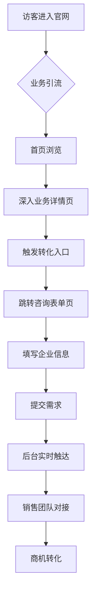

# 神机营B2B品牌官网 PRD

## 1. 产品概述

**项目名称**: 神机营B2B品牌官网（toB官网）
**项目类型**: 企业级品牌展示与线索转化平台
**核心定位**: 面向B端客户的企业官网，以线索转化与客户触达为核心业务闭环
**目标用户**: 有合作意向的企业客户、投资人、加盟商、品牌合作方

---

## 2. 核心功能模块

### 2.1 用户角色

| 角色 | 说明 | 核心权限 |
|------|------|----------|
| 游客 | 未登录访客 | 浏览官网全部内容、提交咨询表单 |
| B端客户 | 有合作意向的企业 | 查看业务详情、提交合作需求 |
| 投资客户 | 加盟/投资人 | 查看投资政策、提交加盟申请 |

### 2.2 功能模块清单

| 序号 | 页面名称 | 核心功能描述 |
|------|----------|--------------|
| 1 | 首页 | 品牌宣传、核心业务入口、客户案例、转化入口 |
| 2 | 产品销售业务页 | 全品类产品矩阵展示、合作政策、报价申请 |
| 3 | EPC+O全流程服务页 | 服务链路展示、项目案例、定制方案申请 |
| 4 | 数字运动潮玩馆页 | 馆型规划、运营支持、团队对接 |
| 5 | 招商加盟合作页 | 三类合作模式、投资回报、合作政策 |
| 6 | 供应链与品牌合作页 | 供应链能力展示、品牌合作案例 |
| 7 | 全链路客户服务页 | 服务体系展示、需求提交表单 |
| 8 | 咨询落地页 | 统一咨询表单、联系方式 |

---

## 3. 核心业务流程

### 3.1 线索转化闭环流程

### 3.2 转化入口分布

| 页面 | 转化入口位置 | 转化动作 |
|------|-------------|----------|
| 首页 | 首屏固定悬浮、页尾 | 立即咨询 |
| 业务详情页 | 页面中部、页面底部 | 获取方案/申请报价 |
| 供应链合作页 | 页面底部 | 申请合作对接 |
| 客户服务页 | 全页面嵌入 | 提交服务需求 |

---

## 4. 视觉与交互设计

### 4.1 设计风格

**设计语言**: 苹果官网标志性极简高级设计
- **视觉基底**: 大面积留白，层次清晰的中性配色
- **光影效果**: 细腻的光影过渡，流畅的微交互动效
- **科技感**: 简洁克制又具科技感的视觉呈现
- **字体层级**: 无衬线字体族，字重/行高/间距打造清晰信息层级

### 4.2 色彩规范

| 用途 | 色值 | 说明 |
|------|------|------|
| 主色 | #1d1d1f | 深邃黑，用于标题和重要文字 |
| 辅助色 | #f5f5f7 | 浅灰白，用于背景和卡片 |
| 强调色 | #0071e3 | 苹果蓝，用于CTA按钮和链接 |
| 成功色 | #34c759 | 用于成功状态 |
| 中性色 | #86868b | 用于次要文字 |
| 白色 | #ffffff | 纯白，用于高亮区域 |
| 背景渐变 | linear-gradient(180deg, #f5f5f7 0%, #ffffff 100%) | 页面背景渐变 |

### 4.3 字体规范

| 用途 | 字体 | 字重 | 字号 |
|------|------|------|------|
| 主标题 | SF Pro Display / -apple-system | 700 | 48-96px |
| 副标题 | SF Pro Display / -apple-system | 600 | 28-40px |
| 正文 | SF Pro Text / -apple-system | 400 | 17-21px |
| 辅助文字 | SF Pro Text / -apple-system | 400 | 12-14px |
| 按钮文字 | SF Pro Text / -apple-system | 500 | 17px |

### 4.4 动效规范

| 动效类型 | 参数 | 场景 |
|----------|------|------|
| 渐入动画 | opacity 0→1, 600ms ease-out | 页面加载元素 |
| 悬浮缩放 | scale 1.02, 300ms ease | 卡片悬浮 |
| 按钮反馈 | scale 0.98, 150ms ease | 按钮点击 |
| 页面滚动 | scroll-behavior smooth | 全站滚动 |
| 视差滚动 | translateY, 0.5x speed | Hero区域 |

### 4.5 页面响应式断点

| 设备 | 宽度 | 布局调整 |
|------|------|----------|
| 桌面端 | ≥1024px | 多列布局，完整导航 |
| 平板端 | 768-1023px | 双列布局，简化导航 |
| 移动端 | <768px | 单列布局，汉堡菜单 |

---

## 5. 页面详细设计

### 5.1 首页

| 模块 | 名称 | 设计描述 |
|------|------|----------|
| 1.1 | 全屏Hero区 | 品牌Slogan+动态背景+固定悬浮咨询按钮 |
| 1.2 | 核心业务板块 | 4个业务卡片：产品销售/EPC+O/数字运动/招商加盟 |
| 1.3 | 核心优势模块 | 供应链能力+服务体系+品牌资源 |
| 1.4 | 客户案例区 | 标杆客户Logo墙+案例卡片 |
| 1.5 | 页尾转化区 | 重复咨询入口+联系方式 |

### 5.2 业务详情页（产品销售为例）

| 模块 | 名称 | 设计描述 |
|------|------|----------|
| 2.1 | Hero区 | 产品矩阵展示+CTA |
| 2.2 | 产品分类 | 全品类产品展示（食品/饮料/日用品等） |
| 2.3 | 合作政策 | 供货政策+价格体系+售后保障 |
| 2.4 | 转化区 | 「申请产品报价」「对接销售团队」按钮 |
| 2.5 | 底部CTA | 重复转化入口 |

### 5.3 招商加盟页

| 模块 | 名称 | 设计描述 |
|------|------|----------|
| 3.1 | Hero区 | 三类合作模式介绍 |
| 3.2 | 特许加盟 | 城市独家政策+加盟费+抽佣比例 |
| 3.3 | 合资联营 | 合作条件+投资占比 |
| 3.4 | 品牌授权 | 授权政策+品牌支持 |
| 3.5 | 投资回报 | ROI计算模型+回本周期 |
| 3.6 | 申请入口 | 「申请加盟考察」「预约线下洽谈」 |

### 5.4 咨询落地页

| 模块 | 名称 | 设计描述 |
|------|------|----------|
| 4.1 | 表单区 | 企业名称+对接人+电话+合作类型+需求简述 |
| 4.2 | 联系方式 | 商务热线+企业微信+邮箱 |
| 4.3 | 成功提示 | 表单提交成功动画+后续流程说明 |

---

## 6. 技术实现要求

### 6.1 性能指标

| 指标 | 要求 |
|------|------|
| 首屏加载时长 | ≤2秒 |
| 页面切换动画 | 300-500ms |
| 滚动帧率 | 60fps |
| 图片懒加载 | 按需加载 |

### 6.2 无障碍要求

- 支持键盘导航
- 图片Alt文本
- 颜色对比度 ≥ 4.5:1
- 表单标签关联

### 6.3 SEO要求

- Meta标签完整
- 结构化数据
- 语义化HTML
- sitemap.xml

## 7. 需求卡（预备补齐）

| RQ | 标题 | 优先级 | 验收标准 |
|:---|:-----|:------:|:---------|
| RQ-B2B-01 | 首页品牌主张呈现 | P0 | 首屏需在 3 秒内传达品牌定位、核心业务和咨询入口 |
| RQ-B2B-02 | 业务页分层展示 | P0 | 产品销售、EPC+O、数字运动馆、招商加盟四类业务均有独立入口与详情说明 |
| RQ-B2B-03 | 统一线索收口 | P0 | 所有高意向页面至少具备 1 个可见 CTA，并汇入统一咨询表单 |
| RQ-B2B-04 | 咨询表单闭环 | P0 | 表单需支持企业名称、联系人、电话、合作类型、需求简述，并提供提交成功反馈 |
| RQ-B2B-05 | 客户案例与信任背书 | P1 | 首页或业务页需展示客户案例、合作模式或品牌能力证明 |
| RQ-B2B-06 | 响应式与无障碍 | P1 | 桌面、平板、移动端均可访问，关键图片具备 alt，表单标签可读 |
| RQ-B2B-07 | SEO 基础设施 | P1 | 页面需具备 meta、语义化结构、站点地图和结构化数据基础能力 |
| RQ-B2B-08 | 商务触达信息一致 | P1 | 商务热线、企业微信、邮箱等触点在咨询页与页尾保持一致 |

## 8. 验收卡（自动化可映射）

| AC | 场景 | 前置 | 预期 |
|:---|:-----|:-----|:-----|
| AC-B2B-01 | 打开官网首页 | 首页已部署 | 首屏可见品牌主张、核心业务和 CTA |
| AC-B2B-02 | 点击任一业务卡片 | 首页正常加载 | 可跳转到对应业务详情区域或页面 |
| AC-B2B-03 | 在业务页底部查找转化入口 | 进入产品销售/EPC/加盟任一页面 | 页面存在“立即咨询”“申请报价”或等价 CTA |
| AC-B2B-04 | 提交完整咨询表单 | 表单字段均已填写 | 表单提交成功并展示成功提示 |
| AC-B2B-05 | 缺少必填项提交表单 | 联系电话或企业名称为空 | 阻止提交并提示缺失字段 |
| AC-B2B-06 | 切换至移动端宽度浏览 | 视口宽度 < 768px | 页面单列展示且 CTA、表单可操作 |
| AC-B2B-07 | 抽查页面源码 | 页面可访问 | 存在 title/description/语义化结构或 sitemap 配置 |
| AC-B2B-08 | 对比咨询页和页尾联系方式 | 首页与咨询页均可访问 | 联系方式字段一致，无冲突文案 |

## 9. 不在本次预备稿范围

- CRM 商机自动分配与销售漏斗评分
- 多语言官网完整翻译交付
- 在线客服机器人接待策略
- CMS 后台编辑器的权限细分
