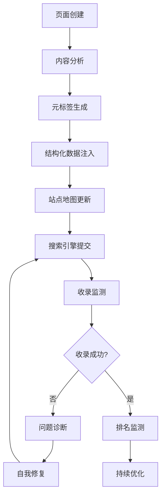
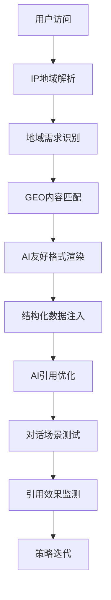

# 神机营SEO与GEO智能优化系统 PRD

## 1. 产品概述

**项目名称**: SEO/GEO智能优化引擎 (SEO-GEO-Engine)
**项目类型**: 面向B2B官网的智能化搜索引擎优化与AI对话智能体内容优化系统
**核心定位**: 构建具备全链路智能化能力的SEO与GEO技术体系，实现搜索引擎与AI场景双重流量竞争力
**目标用户**: B2B官网运营团队、数字营销部门

---

## 2. 核心功能模块

### 2.1 SEO自动化引擎

| 序号 | 模块 | 功能描述 |
|------|------|----------|
| 1.1 | 元标签智能生成 | 基于页面内容AI生成title、description、keywords、OG标签 |
| 1.2 | 动态站点地图 | 自动检测新页面、优先级排序、最后修改时间 |
| 1.3 | 结构化数据生成 | JSON-LD Schema (Organization, LocalBusiness, FAQ, BreadcrumbList) |
| 1.4 | 语义内容优化 | TF-IDF分析、内链策略、语义关键词扩展 |
| 1.5 | 性能监控 | Core Web Vitals (LCP/FID/CLS) 7×24小时监控 |
| 1.6 | 收录管理 | 对接百度/Google站长平台，实时同步收录状态 |
| 1.7 | 移动适配 | 响应式检测、视口配置、内容同源同步 |
| 1.8 | robots.txt管理 | 动态配置、爬虫频率控制、恶意流量拦截 |

### 2.2 GEO智能引擎

| 序号 | 模块 | 功能描述 |
|------|------|----------|
| 2.1 | AI引用优化 | 生成适配ChatGPT/DeeSeek/豆包引用逻辑的结构化内容 |
| 2.2 | 地域标签系统 | IP解析、地域需求识别、区域化关键词布局 |
| 2.3 | 地域落地页 | 基于地域自动渲染的Local SEO落地页 |
| 2.4 | AI友好结构化 | 为AI对话引用优化的JSON-LD切片、FAQ模式 |
| 2.5 | 多渠道适配 | 同步适配传统搜索引擎与AI对话的双重规则 |

### 2.3 智能化自治系统

| 序号 | 模块 | 功能描述 |
|------|------|----------|
| 3.1 | 自我学习 | 抓取算法更新、竞品分析、策略迭代 |
| 3.2 | 自我检测 | 核心指标监测、异常识别、根因分析 |
| 3.3 | 自我创造 | AI生成原创内容、元标签、区域化素材 |
| 3.4 | 自我实现 | 自动执行优化动作、代码微调、内容更新 |
| 3.5 | 自我进化 | 基于效果数据的模型迭代、策略优化 |

### 2.4 社媒整合系统

| 序号 | 模块 | 功能描述 |
|------|------|----------|
| 4.1 | 社交分享 | 一键分享微信/抖音/LinkedIn/Open Graph配置 |
| 4.2 | 联系组件 | 企业微信/手机/邮箱的移动端适配触发 |
| 4.3 | UTM追踪 | 全链路转化追踪、用户路径分析 |
| 4.4 | 埋点体系 | 搜索行为、AI咨询行为、社媒触点埋点 |

---

## 3. 核心业务流程

### 3.1 SEO优化流程



### 3.2 GEO优化流程



---

## 4. 智能化等级定义

| 等级 | 能力 | 人工干预 |
|------|------|----------|
| L1 | 基础自动化 | 全部自动，无需人工 |
| L2 | 智能辅助 | AI建议，人工确认 |
| L3 | 半自治 | 自动执行95%，极端场景人工 |
| L4 | 高度自治 | 自动执行99%，重大变更上报 |
| L5 | 完全自治 | 全自动，战略决策人工 |

**本系统目标等级: L3-L4**

---

## 5. 性能指标承诺

| 指标类型 | 指标名称 | 目标值 |
|----------|----------|--------|
| SEO | 核心关键词排名提升 | 30%+ (3个月内) |
| SEO | 本地搜索曝光量提升 | 40%+ |
| SEO | 页面收录率 | >95% |
| SEO | Core Web Vitals达标率 | >99% |
| GEO | AI引用量提升 | 50%+ |
| GEO | 区域线索转化率提升 | 25%+ |
| 运营 | 人工干预降低 | 80%+ |
| 异常 | 告警响应时长 | <1小时 |
| 执行 | 常规优化完成率 | >99% |

---

## 7. 技术实现映射

### 7.1 核心文件清单

| 模块 | 文件路径 | 状态 |
|------|----------|------|
| SEO元标签生成 | `lib/seo/meta-generator.ts` | ✅ 已完成 |
| 动态站点地图 | `lib/seo/sitemap-generator.ts` | ✅ 已完成 |
| 性能监控服务 | `lib/seo/performance-monitor.ts` | ✅ 已完成 |
| AI引用优化器 | `lib/geo/ai-reference-optimizer.ts` | ✅ 已完成 |
| IP地域解析 | `lib/geo/geo-ip-resolver.ts` | ✅ 已完成 |
| AI内容生成 | `lib/intelligent/content-generator.ts` | ✅ 已完成 |
| 自治系统核心 | `lib/intelligent/self-system.ts` | ✅ 已完成 |
| SEO元标签组件 | `components/seo/SEOMeta.tsx` | ✅ 已完成 |
| 监测看板组件 | `components/seo/MonitoringDashboard.tsx` | ✅ 已完成 |
| 分享按钮组件 | `components/social/ShareButtons.tsx` | ✅ 已完成 |
| 联系按钮组件 | `components/social/ContactButtons.tsx` | ✅ 已完成 |
| 站点地图API | `sitemap.xml/route.ts` | ✅ 已完成 |
| Robots.txt API | `robots.txt/route.ts` | ✅ 已完成 |
| 地域解析API | `api/geo/route.ts` | ✅ 已完成 |
| 监测看板页面 | `monitoring/page.tsx` | ✅ 已完成 |

### 7.2 服务导出索引

| 索引文件 | 说明 |
|----------|------|
| `lib/seo/index.ts` | SEO服务统一导出 |
| `lib/geo/index.ts` | GEO服务统一导出 |
| `lib/intelligent/index.ts` | 智能化服务统一导出 |
| `components/seo/index.ts` | SEO组件统一导出 |
| `lib/social/index.ts` | 社媒组件统一导出 |

---

## 8. 部署与配置

### 8.1 环境变量

```env
NEXT_PUBLIC_BASE_URL=https://www.shenjiying.com
NEXT_PUBLIC_GEO_API_KEY=xxx  # 可选，第三方IP解析API
```

### 8.2 路由配置

| 路由 | 说明 |
|------|------|
| `/sitemap.xml` | 动态站点地图 |
| `/robots.txt` | 动态robots配置 |
| `/api/geo` | 地域解析API |
| `/monitoring` | SEO监测看板 |

---

## 9. 12周落地Roadmap

| 阶段 | 时间 | 里程碑 |
|------|------|--------|
| Phase 1 | Week 1-2 | 基础SEO部署完成，元标签/站点地图/结构化数据上线 |
| Phase 2 | Week 3-4 | 性能监控部署，Core Web Vitals 7×24小时监控 |
| Phase 3 | Week 5-6 | GEO基础能力上线，IP解析/LocalBusiness/FAQ |
| Phase 4 | Week 7-8 | 智能化能力上线，AI内容生成/自我检测/自我优化 |
| Phase 5 | Week 9-10 | 社媒整合上线，分享按钮/UTM追踪 |
| Phase 6 | Week 11-12 | 自治进化上线，自我学习/模型迭代 |

---

## 10. 合规与安全

- 操作日志留存: ≥180天
- 内容版本记录: 完整保留
- 人工审核白名单: 重大策略/跨区域资源调配
- 爬虫管控: UA识别/频率限制/IP封禁
