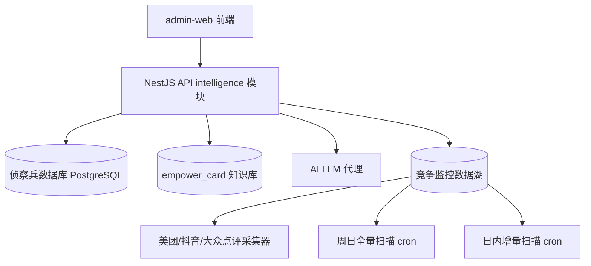

# 📋 PRD-017: P-50 运营参谋系统 V2

> **签发人**: 大飞哥  
> **起草**: 龙虾哥  
> **日期**: 2026-07-19 15:35  
> **状态**: 🔴 起草中 → 🟡 待评审 → 🟢 已签发  
> **E5 赵数据单票否决前置条件**: 必须修复

---

## 一、核心目标

将 P-50 V1 从"全 mock 骨架"升级为：**基于真实侦察兵数据库(349场馆×9维) + AI赋能 + 财务全景表 的可运营系统**。

### 用户故事
- **店长/投资人**: "我想在广州天河开一家电玩城，预算300万→系统给出基于同城真实竞品数据的可行性评分、设备建议、财务预估"
- **店长(已开业)**: "我店附近有竞品降价了→系统自动检测并给出3个应对方案"
- **区域总监**: "看到我管辖城市所有竞品本月的异动汇总"

---

## 二、功能规格 (RQ-50-XX)

### RQ-50-01: 可行性报告 · 基于真实数据

| 属性 | 值 |
|:-----|:----|
| 输入 | 城市 + 区域 + 预算(100-1000万) + 面积(200-2000㎡) + 档次(经济/标准/精装/豪华) |
| 输出 | 可行性报告(见下方结构) |
| 数据源 | 侦察兵数据库 → PostgreSQL 竞品分析表 |
| AI 程度 | AI 基于数据推理 + empower_card 知识库 |

**报告结构**:
```
📊 [城市][区域] 可行性报告
├── 总评分: XX/100 (置信区间: XX-YY)
│   └── 等级: 🟢非常适合 / 🟡可考虑 / 🔴不建议
├── 竞争分析
│   ├── 同城竞品数量: XX家
│   ├── 同区域分布: 饼图(区域1:3家/区域2:2家...)
│   ├── 平均客单价: ¥XX
│   └── 竞争密度等级: 高/中/低
├── 财务全景表 (RQ-50-03)
│   ├── 首期投入: 设备XX + 装修XX + 系统XX + 保证金XX
│   ├── 月固定成本: 租金XX + 人力XX + 维护XX + SAASXX
│   ├── 月变动成本: 电费XX + 耗材XX + 推广XX
│   ├── 预估月营收: ¥XX(基于同城竞品数据)
│   └── 预估回收期: XX个月
├── 设备建议 (RQ-50-04)
│   ├── [设备名] × [台数] = ¥[成本] → [推荐供应商/型号]
│   └── ...
├── 风险因素
│   ├── 🔴 同城竞品密度高 → 建议差异化定位
│   ├── 🟡 装修成本超预算 → 建议经济档方案
│   └── 🟢 预算充裕 → 可配置高端设备
└── AI 综合建议 (由大模型基于以上数据生成)
```

### RQ-50-02: 运营参谋 · AI选择题 V2

| 属性 | 值 |
|:-----|:----|
| 输入 | 门店ID + 咨询类别(pricing/activity/equipment/promotion/recruit/partnership) |
| 输出 | 选择题界面 + AI建议(基于真实数据分析) |
| AI 程度 | AI 检索同城竞品数据 + empower_card → 自然语言建议 |

**AI 建议生成流程**:
```
用户问"如何定价?" 
  → 查询该城市竞品的最近价格 (PostgreSQL)
  → 查询 empower_card 中定价策略知识
  → AI 综合推理 → 输出"个性化建议"
  → 展示 3 个选择题方案(含 pros/cons/预估效果)
```

**活动参谋扩充至 6 大类**:
1. 抖音/美团团购套餐
2. 周末主题比赛
3. 会员日/会员专属
4. 联名活动/IP跨界
5. 暑假/寒假限定活动
6. 盲盒/抽奖促销(合规版)

### RQ-50-03: 竞争监控 · 真实数据管道

| 属性 | 值 |
|:-----|:----|
| 输入 | 门店ID (自动关联城市+区域) |
| 数据源 | 侦察兵采集(周日全量) + 日内增量扫描 |
| 检测类型 | 价格调整 / 新活动 / 新优惠 / 评价变化 / 设备异动 |
| 响应时效 | 日内 2h 内检测 |
| 告警推送 | P0 紧急 → 短信/App 推送 / P1 关注 → App 通知 / P2 观察 → 仪表盘 |

### RQ-50-04: 设备建议 · 供应商级

基于同城竞品设备清单数据，推荐具体品牌/型号/供应商：
```
推荐: [品牌] 射击街机 × 8台
└── 单价: ¥40,000
└── 供应商: 深圳XX设备商 (资质已验证)
└── 保修: 3年
└── 月维护: ¥200/台
```

### RQ-50-05: 装修成本估算

基于参考面积和档次自动估算：
```
面积: 500㎡ | 档次: 标准
├── 基础装修 (水电/地面/墙面): ¥XX
├── 主题设计: ¥XX
├── 家具/装饰: ¥XX
├── 审批/消防: ¥XX
└── 小计: ¥XX (约占预算 XX%)
```

---

## 三、非功能性需求

| 维度 | 要求 |
|:-----|:-----|
| API 响应 | 可行性报告 ≤ 3s，选择题 ≤ 1s，监控 ≤ 500ms |
| 数据时效 | 可行性报告的竞品数据 ≤ 7天 |
| 多租户 | 所有接口加 tenant_id 隔离 |
| 前端 | 骨架屏 + 移动端适配 |
| 审计 | 所有 AI 决策日志记录(empower_card quote_log) |
| 安全 | POST /feasibility 加 rate limit + 输入校验 |
| 免责 | 报告顶部加"仅供参考"声明 |

---

## 四、架构设计



### 数据流
```
用户输入城市+区域
  → 查询同城竞品数据 (PostgreSQL)
  → 计算可行性评分 (基于真实数据)
  → 查询 empower_card 匹配知识
  → AI LLM 生成综合建议
  → 缓存到 Redis (TTL 1h)
  → 返回前端
```

---

## 五、API 契约

```
POST /intelligence/feasibility      # 可行性报告 (V2)
  Body: { city, district, budget, area?, tier? }
  Response: FeasibilityReport

GET /intelligence/operations/:storeId  # 运营参谋 (V2)
  Query: ?category=pricing&ai=true
  Response: OperationAdviceChoice[]

GET /intelligence/monitor/:storeId   # 竞争监控 (V2)
  Query: ?type=all&severity=high&page=1&limit=20
  Response: { alerts: CompetitorAlert[], total, page }

POST /intelligence/feasibility/data  # 查询接口(内部)
  Body: { city, district }
  Response: { density, avgPrice, competitors[] }

POST /intelligence/feasibility/finance  # 财务计算(V2)
  Body: { budget, area, tier, city, district }
  Response: FinancePanorama
```

---

## 六、测试要求

| 模块 | 类型 | 最低test数 | 说明 |
|:-----|:-----|:----------:|:-----|
| 可行性服务 | unit | 15 | 城市数据/预算/面积组合 |
| 运营参谋 | unit | 15 | 6类活动×正反边界 |
| 竞争监控 | unit | 10 | 4类型告警×严重度分级 |
| Controller | e2e | 10 | 3端点×输入校验×限流 |
| admin前端 | component | 12 | 加载态×空态×错误态×主功能 |
| **合计** | | **62** | 原24→62 (+38) |

---

## 七、依赖项

| # | 依赖 | 状态 | 备注 |
|:-:|:-----|:----:|:-----|
| 1 | 侦察兵数据库 PostgreSQL 建表 | ⬜ 未做 | 349场馆数据需从 md 迁移到 DB |
| 2 | empower_card 知识库 API 就绪 | ✅ 已就绪 | 233条知识已导入 |
| 3 | AI LLM 接口(deepseek/api proxy) | 🟡 在建 | 需要统一AI代理层 |
| 4 | 竞争数据采集器 | ⬜ 未做 | 美团/抖音爬虫 |
| 5 | 日内增量扫描 cron | ⬜ 未做 | 2h 间隔 |

---

## 八、评审签署

| 门 | 专家 | 状态 | 日期 |
|:--:|:----:|:----:|:----:|
| Gate 1 | E1陈架构 | ⬜ | — |
| Gate 2 | E4张营销/E8周运营/E11钱店长 | ⬜ | — |
| Gate 3 | E5赵数据/E9吴AI | ⬜ | — |
| Gate 4 | E7孙体验/E40杨客户 | ⬜ | — |
| Gate 5 | E10郑财务/E36卫审计 | ⬜ | — |
| Gate 6 | E38沈监管/E6刘合规 | ⬜ | — |
| 总签 | E41+E42+E44 | ⬜ | — |

---

*本需求卡遵循 ADR-045 科学知识体系 V2 · 五环闭环 · V20 规范*
