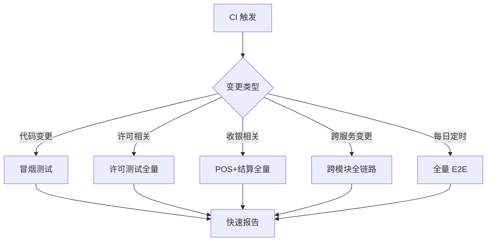

# 🧪 E2E — 端到端测试

> 神机营 SaaS 平台端到端测试根目录。
>
> 基于 **Playwright** 框架构建，覆盖 **8 个角色视角**的前端页面冒烟验证与 **22+ 条跨模块全链路测试**。
> 以"🦞 龙虾哥"为执行代号，累计维护 **~338 个 subtests**，覆盖 admin-web、storefront-web、tob-web、miniapp、mobile 等多个入口。

---

## 目录

- [模块概述](#模块概述)
- [测试策略](#测试策略)
- [目录结构](#目录结构)
- [文件详解](#文件详解)
  - [冒烟测试](#冒烟测试-smoke)
  - [测试基础设施](#测试基础设施-fixtures--pages--utils)
  - [许可管理测试](#许可管理测试-license)
  - [收银 POS 测试](#收银-pos-测试-cashier)
  - [结算金额测试](#结算金额测试-checkout)
  - [跨模块链路测试](#跨模块链路测试-cross-module)
  - [会员全流程测试](#会员全流程测试-member)
  - [响应式测试](#响应式测试-responsive)
- [测试执行环境](#测试执行环境)
- [运行指南](#运行指南)
- [CI/CD 集成](#cicd-集成)
- [常见问题](#常见问题)

---

## 模块概述

E2E 测试是神机营平台质量保障体系的最外层防线，主要负责：

1. **冒烟验证** — 快速确认 8 个角色视角下的前端核心页面可正常加载且功能无阻断
2. **全链路验证** — 串联前端 → API → 数据库 → 通知等多个微服务，验证完整业务流程
3. **许可生命周期** — 许可激活、续期、检查、错误处理、安全边界、性能基准
4. **收银与结算** — POS 收银、金额计算、优惠叠加、折扣分摊
5. **会员全流程** — 注册、充值、消费、积分累计与兑换
6. **响应式适配** — 多端 viewport 验证，确保五端统一体验
7. **回归守护** — 关键业务变更后的回归测试，防止意外破坏

测试落地于 monorepo 的 `e2e/` 目录，通过 `playwright.config.ts` （项目根级）配置多 project 运行。

---

## 测试策略

### 分层策略

```
L0: 单元测试 (packages/*/src/*.test.ts, apps/*/app/*.test.ts[x])
    ↓ 快速、轻量、覆盖核心逻辑
L1: 组件测试 (@testing-library/react, happy-dom)
    ↓ 验证组件交互、状态变化
L2: API 集成测试 (apps/api/*.test.ts)
    ↓ 多模块 API 协作验证
L3: E2E 端到端测试 (e2e/)  ← 本目录
    ↓ 浏览器环境、真实后端、完整链路
L4: 手动探索测试
    ↓ 生产环境、异常场景、边界探索
```

### 覆盖维度

| 维度 | 说明 |
|------|------|
| **角色维度** | 8 个角色（店长/前台/HR/安监/导玩员/运行专员/团建/营销） |
| **页面维度** | 每角色 ~10 个关键页面，全量冒烟合计 ~80 页 |
| **流程维度** | 许可全生命周期、收银全流程、会员全流程 |
| **链路维度** | 11 条跨模块全链路（SKU/通知/退款/i18n/BI/集成） |
| **设备维度** | 五端响应式适配（Desktop/Tablet/Mobile Small/Medium/Large） |

### 正例 / 反例 / 边界

每个测试用例按"三级覆盖"编写：

```typescript
// 正例: 正常流程应成功
test('正常添加商品到购物车', async () => { /* ... */ });

// 反例: 非法输入应拒绝
test('添加已下架商品应提示错误', async () => { /* ... */ });

// 边界: 边界值应正确处理
test('购物车达到上限时添加应提示', async () => { /* ... */ });
```

### 执行时序



---

## 目录结构

```
e2e/
├── README.md                              # 本文件
├── smoke-role-frontend.spec.ts            # 🧪 8 角色视角前端冒烟 (188+ subtests)
├── pages/                                 # 🏗 页面对象模型
│   ├── base.page.ts                       # 基类: 通用导航、等待、断言、截图
│   └── license.page.ts                    # 许可管理页面: 激活、检查、续期操作
├── fixtures/                              # 🛠 测试夹具与测试数据
│   ├── auth.fixture.ts                    # 认证授权夹具 (8 角色登录态模拟)
│   └── test-data.ts                       # 测试数据工厂 (种子数据、测试账号)
├── utils/                                 # 🔧 工具函数
│   └── test-helpers.ts                    # 通用辅助方法 (等待、重试、格式化)
└── tests/                                 # 📝 测试用例目录 (22 文件)
    ├── README.md                          # 测试用例详细说明
    ├── license-activate.spec.ts           # 许可激活
    ├── license-check.spec.ts              # 许可检查
    ├── license-manage.spec.ts             # 许可管理
    ├── license-manage-extended.spec.ts    # 许可管理扩展
    ├── license-error.spec.ts              # 许可错误处理
    ├── license-regression.spec.ts         # 许可回归测试
    ├── license-security.spec.ts           # 许可安全边界
    ├── license-performance.spec.ts        # 许可性能基准
    ├── license-5end-adaptation.spec.ts    # 许可五端适配
    ├── cashier-pos-minimal.spec.ts        # 收银 POS 最小可用
    ├── cashier-pos-enhanced.spec.ts       # 收银 POS 增强测试
    ├── checkout-amount-enhanced.spec.ts   # 结算金额增强
    ├── checkout-amount-l3.spec.ts         # 结算金额 L3 跨模块
    ├── member-full-flow.spec.ts           # 会员全流程
    ├── cross-module-chain-full.spec.ts    # 跨模块全链路
    ├── cross-module-chain16-*.test.ts     # SKU 生命周期缓存
    ├── cross-module-chain17-*.test.ts     # 通知管道
    ├── cross-module-chain18-*.test.ts     # 退款全流程
    ├── cross-module-chain37-*.test.ts     # i18n 内容同步
    ├── cross-module-chain38-*.test.ts     # BI 分析导出
    ├── cross-module-chain39-*.test.ts     # Storefront 集成
    ├── e2e-l3-baseline-storefront-*.test.ts    # L3 店面前台基线
    ├── responsive/
    │   └── 5-end-validation.spec.ts       # 五端适配验证
    └── utils/
        └── test-helpers.ts                # 测试工具函数
```

---

## 文件详解

### 冒烟测试 (Smoke)

#### `smoke-role-frontend.spec.ts`

核心冒烟文件，以 8 个"角色人"视角逐页验证前端关键页面。

| 角色人 | 角色类型 | 覆盖页面数 |
|--------|----------|------------|
| 店长 | Store Manager | ~10 页 |
| 前台主管 | Front Desk Supervisor | ~10 页 |
| HR | HR Manager | ~10 页 |
| 安监 | Safety Inspector | ~10 页 |
| 导玩员 | Game Guide | ~10 页 |
| 运行专员 | Operations Specialist | ~10 页 |
| 团建专员 | Team Building Coordinator | ~10 页 |
| 营销经理 | Marketing Manager | ~10 页 |

每页验证：页面加载、核心元素存在、关键交互可用、错误边界处理。总计 188+ subtests。

### 测试基础设施 (Fixtures / Pages / Utils)

#### `fixtures/auth.fixture.ts`

认证夹具，使用 OAuth 2.0 client credentials 流获取 8 个角色的访问令牌：

```typescript
import { authFixture } from '../fixtures/auth.fixture';

const test = authFixture; // 注入已认证的 page 对象

test('店长页面冒烟', async ({ adminPage }) => {
  await adminPage.goto('/dashboard');
  await expect(adminPage.locator('h1')).toContainText('仪表盘');
});
```

#### `fixtures/test-data.ts`

测试数据工厂，提供种子数据与测试账号常量。包含：

- 测试用户凭据 (8 角色、多租户)
- 商品/门店/会员测试数据生成器
- API 响应 Mock 数据模板

#### `pages/base.page.ts`

Page Object 基类，封装通用操作：

```typescript
class BasePage {
  async navigate(path: string): Promise<void>   // 导航
  async waitForPageLoad(): Promise<void>        // 等待加载
  async takeScreenshot(name: string): Promise<void>  // 截图
  async assertElementVisible(selector: string): Promise<void>  // 元素可见断言
  async assertUrlContains(text: string): Promise<void>  // URL 断言
  async retryClick(selector: string, retries?: number): Promise<void>  // 重试点击
}
```

#### `pages/license.page.ts`

许可管理专有 Page Object，封装许可生命周期操作：

- `activateLicense(key)` — 激活许可
- `checkLicenseStatus(licenseId)` — 检查状态
- `renewLicense(licenseId)` — 续期
- `getLicenseErrors()` — 获取错误列表
- `getLicenseLimits()` — 获取限制信息

#### `utils/test-helpers.ts`

通用辅助函数：

```typescript
export function waitForCondition(condition, timeout, interval): Promise<void>
export function randomString(length): string
export function formatCurrency(amount): string
export function retryAsync(fn, retries, delay): Promise<any>
export function generateTestEmail(): string
```

### 许可管理测试 (License)

共 8 个测试文件，覆盖许可完整生命周期：

| 文件 | 测试内容 |
|------|----------|
| `license-activate.spec.ts` | 许可激活流程（正例/反例/体验期/错误码） |
| `license-check.spec.ts` | 许可状态检查（有效/过期/暂停/黑名单） |
| `license-manage.spec.ts` | 许可管理操作（查看/转移/升级/降级） |
| `license-manage-extended.spec.ts` | 许可扩展管理（批量操作/多租户/委托） |
| `license-error.spec.ts` | 许可错误处理（网络异常/冲突/回滚） |
| `license-regression.spec.ts` | 许可回归测试（变更后关键场景验证） |
| `license-security.spec.ts` | 许可安全边界（越权/注入/重放攻击/频率限制） |
| `license-performance.spec.ts` | 许可性能基准（激活响应时间/并发/压力） |
| `license-5end-adaptation.spec.ts` | 许可五端适配（响应式布局/触控交互/离线提示） |

### 收银 POS 测试 (Cashier)

| 文件 | 测试内容 |
|------|----------|
| `cashier-pos-minimal.spec.ts` | POS 核心流程（商品扫码/结算/打印/支付） |
| `cashier-pos-enhanced.spec.ts` | POS 增强场景（多商品/优惠叠加/退款/挂单/换班） |

### 结算金额测试 (Checkout)

| 文件 | 测试内容 |
|------|----------|
| `checkout-amount-enhanced.spec.ts` | 金额计算增强（折扣/满减/会员价/组合优惠） |
| `checkout-amount-l3.spec.ts` | L3 跨模块结算验证（结算 → 库存扣减 → 通知发送） |

### 跨模块链路测试 (Cross Module)

跨模块测试串联多个微服务，验证端到端业务流程：

| 文件 | 涉及模块 | 流程描述 |
|------|----------|----------|
| `cross-module-chain-full.spec.ts` | 全域 | 全链路综合验证（创建→下单→履约→完成） |
| `cross-module-chain16-*.test.ts` | 商品 + 缓存 + SKU | SKU 生命周期缓存一致性 |
| `cross-module-chain17-*.test.ts` | 订单 + 通知 | 通知管道（下单触发通知送达） |
| `cross-module-chain18-*.test.ts` | 订单 + 退款 + 财务 | 退款全流程（申请→审批→到账） |
| `cross-module-chain37-*.test.ts` | 内容 + i18n | i18n 内容多语言同步 |
| `cross-module-chain38-*.test.ts` | BI + 报表 | BI 分析数据导出完整性 |
| `cross-module-chain39-*.test.ts` | Storefront + 集成 | Storefront 集成场景 |

### 会员全流程测试 (Member)

| 文件 | 测试内容 |
|------|----------|
| `member-full-flow.spec.ts` | 会员注册 → 充值 → 消费 → 积分累计 → 兑换完整流程 |

### 响应式测试 (Responsive)

| 文件 | 设备覆盖 | 测试内容 |
|------|----------|----------|
| `responsive/5-end-validation.spec.ts` | Desktop/Tablet/Mobile S/M/L | 五端 viewport 适配验证 |

---

## 测试执行环境

### 前置条件

```bash
# 1. 安装 Playwright 浏览器
pnpm exec playwright install chromium

# 2. 确保 API 服务运行
pnpm --filter @m5/api dev

# 3. 确保前端应用运行 (按需)
pnpm --filter @m5/admin-web dev   # 管理后台
pnpm --filter @m5/storefront-web dev  # 前台
```

### 环境变量

```bash
PLAYWRIGHT_BASE_URL=http://localhost:3002   # 前端 URL
M5_API_BASE_URL=http://localhost:3001      # 后端 API URL
M5_E2E_USERNAME=test_admin                # 测试账号
M5_E2E_PASSWORD=test_password             # 测试密码
M5_E2E_TENANT_ID=tnt-test                  # 租户 ID
```

### 依赖服务

```
┌─────────────┐      ┌──────────────┐
│  Playwright  │ ───> │  APP Web     │
│  Test Runner │      │  (3002)      │
└─────────────┘      └──────┬───────┘
                            │
              ┌─────────────▼──────────┐
              │  API Gateway (3001)     │
              │  ┌─────┐ ┌────┐ ┌────┐ │
              │  │Auth │ │Order│ │... │ │
              │  └─────┘ └────┘ └────┘ │
              └──────────┬─────────────┘
                         │
              ┌──────────▼─────────────┐
              │  Database (PostgreSQL) │
              └────────────────────────┘
```

---

## 运行指南

### 全量运行

```bash
# 运行所有 E2E 测试
pnpm exec playwright test --project=chromium e2e/
```

### 按分类运行

```bash
# 冒烟测试
pnpm exec playwright test e2e/smoke-role-frontend.spec.ts

# 许可模块全系列
pnpm exec playwright test e2e/tests/license-*.spec.ts

# 跨模块链路
pnpm exec playwright test e2e/tests/cross-module-*

# 收银 POS
pnpm exec playwright test e2e/tests/cashier-pos-*

# 响应式适配
pnpm exec playwright test e2e/tests/responsive/

# L3 基线
pnpm exec playwright test --project=l3-baseline e2e/
```

### 调试模式

```bash
# UI 模式 (可视化调试)
pnpm exec playwright test --ui e2e/tests/

# 有头模式 (观察浏览器行为)
pnpm exec playwright test --headed e2e/smoke-role-frontend.spec.ts

# 单文件调试
pnpm exec playwright test e2e/tests/member-full-flow.spec.ts --debug

# 指定浏览器
pnpm exec playwright test --project=chromium --headed e2e/
```

### 查看报告

```bash
# 查看 HTML 报告
pnpm exec playwright show-report

# 报告位置
open playwright-report/index.html
```

---

## CI/CD 集成

### 定时执行

测试"龙虾哥"每晚第二段（03:30-05:30 CST）自动执行：

```
┌───────────────┐
│  03:30 CT     │ 分支: main, 执行全量 E2E
│  冒烟 + 许可   │
│  跨模块 + POS  │
│  会员全流程    │
├───────────────┤
│  05:30 CT     │ 报告生成
│  失败分析      │
│  通知钉钉群    │
└───────────────┘
```

### CI 管道集成

```yaml
# .gitlab-ci.yml 片段
e2e-smoke:
  stage: test
  script:
    - pnpm install
    - pnpm exec playwright install chromium
    - pnpm exec playwright test e2e/smoke-role-frontend.spec.ts
  artifacts:
    paths:
      - playwright-report/
    when: always
```

### 重试策略

```typescript
// playwright.config.ts
retries: process.env.CI ? 2 : 1,  // CI 环境重试 2 次
```

---

## 常见问题

### Q: 测试运行失败，提示浏览器未安装

```bash
pnpm exec playwright install chromium
```

### Q: 测试超时 (默认 30s)

在测试文件或 `playwright.config.ts` 中调整：

```typescript
// playwright.config.ts
use: {
  timeout: 60000,       // 单测试超时 60s
  actionTimeout: 30000, // 单操作超时 30s
}
```

### Q: 跨模块测试需要哪些前置服务？

跨模块测试依赖：

- API Gateway (`@m5/api`) 运行中
- 数据库种子数据已初始化
- Redis 缓存可用
- 消息队列 (RabbitMQ) 可用

### Q: 如何添加新的 E2E 测试？

1. 在 `tests/` 下创建 `.spec.ts` 文件
2. 引用 `fixtures/` 中的认证夹具获取登录态
3. 使用 `pages/` 的 Page Object 封装 UI 操作
4. 遵循"正例+反例+边界"三级覆盖原则
5. 运行确认：`pnpm exec playwright test e2e/tests/你的文件.spec.ts`

### Q: 测试夹具里的测试账号在哪里配置？

在 `fixtures/auth.fixture.ts` 和 `fixtures/test-data.ts` 中配置。生产环境通过环境变量注入凭据，避免硬编码。

---

> 🦞 **龙虾哥说**：冒烟不过别下班，链子断了全白干。
> 🦞 **龙虾哥金句**：E2E 是质量的最后防线，守住了天下太平，守不住鸡飞狗跳。
