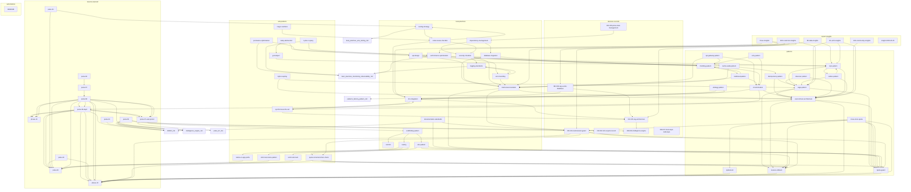

# 知识库关联图

> 自动生成 by `knowledge_graph_generator.py`
> 节点: 70 | 边: 155

```mermaid
graph TD
  subgraph lessons_learned["lessons-learned"]
    lessons_learned_phase_15_md["phase-15"]
    lessons_learned_phase_16_md["phase-16"]
    lessons_learned_pulse_60_md["pulse-60"]
    lessons_learned_pulse_61_md["pulse-61"]
    lessons_learned_pulse_63_md["pulse-63"]
    lessons_learned_pulse_64_md["pulse-64"]
    lessons_learned_pulse_65_md["pulse-65"]
    lessons_learned_pulse_66_md["pulse-66"]
    lessons_learned_pulse_67_wait_period_md["pulse-67-wait-period"]
    lessons_learned_pulse_67_md["pulse-67"]
    lessons_learned_pulse_68_day2_md["pulse-68-day2"]
    lessons_learned_pulse_68_md["pulse-68"]
  end
  subgraph patterns["patterns"]
    patterns_api_gateway_pattern_md["api-gateway-pattern"]
    patterns_bulkhead_pattern_md["bulkhead-pattern"]
    patterns_cache_aside_pattern_md["cache-aside-pattern"]
    patterns_circuit_breaker_md["circuit-breaker"]
    patterns_cqrs_pattern_md["cqrs-pattern"]
    patterns_cross_store_quota_md["cross-store-quota"]
    patterns_event_driven_architecture_md["event-driven-architecture"]
    patterns_idempotency_pattern_md["idempotency-pattern"]
    patterns_observer_pattern_md["observer-pattern"]
    patterns_optional_di_md["optional-di"]
    patterns_outbox_pattern_md["outbox-pattern"]
    patterns_quota_guard_md["quota-guard"]
    patterns_reserve_rollback_md["reserve-rollback"]
    patterns_retry_pattern_md["retry-pattern"]
    patterns_saga_pattern_md["saga-pattern"]
    patterns_strategy_pattern_md["strategy-pattern"]
    patterns_throttling_pattern_md["throttling-pattern"]
  end
  subgraph best_practices["best-practices"]
    best_practices_api_design_md["api-design"]
    best_practices_code_review_checklist_md["code-review-checklist"]
    best_practices_commit_md["commit"]
    best_practices_database_migration_md["database-migration"]
    best_practices_dependency_management_md["dependency-management"]
    best_practices_documentation_standards_md["documentation-standards"]
    best_practices_e2e_pattern_md["e2e-pattern"]
    best_practices_error_handling_md["error-handling"]
    best_practices_llm_integration_md["llm-integration"]
    best_practices_logging_standards_md["logging-standards"]
    best_practices_multi_tenant_isolation_md["multi-tenant-isolation"]
    best_practices_performance_optimization_md["performance-optimization"]
    best_practices_scaffolding_pattern_md["scaffolding-pattern"]
    best_practices_security_checklist_md["security-checklist"]
    best_practices_testing_strategy_md["testing-strategy"]
    best_practices_testing_md["testing"]
  end
  subgraph anti_patterns["anti-patterns"]
    anti_patterns_exit_hook_hack_md["exit-hook-hack"]
    anti_patterns_god_object_md["god-object"]
    anti_patterns_leaky_abstraction_md["leaky-abstraction"]
    anti_patterns_magic_numbers_md["magic-numbers"]
    anti_patterns_n_plus_1_query_md["n-plus-1-query"]
    anti_patterns_native_vs_app_prefix_md["native-vs-app-prefix"]
    anti_patterns_premature_optimization_md["premature-optimization"]
    anti_patterns_quota_increment_then_check_md["quota-increment-then-check"]
    anti_patterns_strict_test_name_pattern_md["strict-test-name-pattern"]
    anti_patterns_synchronous_llm_call_md["synchronous-llm-call"]
    anti_patterns_tight_coupling_md["tight-coupling"]
  end
  subgraph decision_records["decision-records"]
    decision_records_DR_001_multi_tenant_guard_md["DR-001-multi-tenant-guard"]
    decision_records_DR_002_v51_expert_council_md["DR-002-v51-expert-council"]
    decision_records_DR_003_intelligence_engine_md["DR-003-intelligence-engine"]
    decision_records_DR_005_rag_architecture_md["DR-005-rag-architecture"]
    decision_records_DR_006_pinia_state_management_md["DR-006-pinia-state-management"]
    decision_records_DR_007_monorepo_turborepo_md["DR-007-monorepo-turborepo"]
    decision_records_DR_008_rag_vector_database_md["DR-008-rag-vector-database"]
  end
  subgraph expert_insights["expert-insights"]
    expert_insights_E1_arch_insights_md["E1-arch-insights"]
    expert_insights_E16_community_insights_md["E16-community-insights"]
    expert_insights_E40_customer_insights_md["E40-customer-insights"]
    expert_insights_E5_data_insights_md["E5-data-insights"]
    expert_insights_E9_ai_insights_md["E9-ai-insights"]
    expert_insights_insight_2026_06_26_md["insight-2026-06-26"]
  end
  subgraph automations["automations"]
    automations_README_md["README"]
  end
  %% Edges
  lessons_learned_pulse_68_day2_md --> lessons_learned_pulse_67_wait_period_md
  lessons_learned_pulse_68_day2_md --> lessons_learned_phase_15_md
  lessons_learned_pulse_68_day2_md --> lessons_learned_phase_16_md
  lessons_learned_pulse_68_day2_md --> lessons_learned_pulse_63_md
  lessons_learned_pulse_68_day2_md --> lessons_learned_pulse_67_wait_period_md
  lessons_learned_pulse_68_day2_md --> lessons_learned_pulse_63_md
  lessons_learned_pulse_68_day2_md --> lessons_learned_phase_15_md
  lessons_learned_pulse_68_day2_md --> lessons_learned_phase_16_md
  lessons_learned_pulse_68_day2_md --> INDEX_md
  lessons_learned_pulse_60_md --> lessons_learned_phase_15_md
  lessons_learned_pulse_60_md --> lessons_learned_pulse_63_md
  lessons_learned_pulse_64_md --> INDEX_md
  lessons_learned_pulse_65_md --> decision_records_DR_003_intelligence_engine_md
  lessons_learned_pulse_65_md --> intelligence_engine_md
  lessons_learned_pulse_65_md --> decision_records_DR_002_v51_expert_council_md
  lessons_learned_pulse_65_md --> INDEX_md
  lessons_learned_pulse_65_md --> intelligence_engine_md
  lessons_learned_pulse_61_md --> best_practices_testing_strategy_md
  lessons_learned_pulse_61_md --> lessons_learned_pulse_63_md
  lessons_learned_pulse_66_md --> lessons_learned_pulse_67_md
  lessons_learned_pulse_67_wait_period_md --> best_practices_scaffolding_pattern_md
  lessons_learned_pulse_67_wait_period_md --> pulse_67_md
  lessons_learned_pulse_67_md --> lessons_learned_pulse_68_md
  lessons_learned_pulse_68_md --> lessons_learned_pulse_67_wait_period_md
  lessons_learned_pulse_68_md --> lessons_learned_pulse_68_day2_md
  lessons_learned_pulse_68_md --> lessons_learned_phase_15_md
  lessons_learned_pulse_68_md --> lessons_learned_phase_16_md
  lessons_learned_pulse_68_md --> lessons_learned_pulse_63_md
  lessons_learned_pulse_68_md --> lessons_learned_pulse_63_md
  lessons_learned_pulse_68_md --> lessons_learned_pulse_67_wait_period_md
  lessons_learned_pulse_68_md --> lessons_learned_pulse_68_day2_md
  lessons_learned_pulse_68_md --> lessons_learned_phase_15_md
  lessons_learned_pulse_68_md --> lessons_learned_phase_16_md
  lessons_learned_pulse_68_md --> intelligence_engine_md
  patterns_saga_pattern_md --> patterns_event_driven_architecture_md
  patterns_saga_pattern_md --> patterns_quota_guard_md
  patterns_saga_pattern_md --> patterns_reserve_rollback_md
  patterns_api_gateway_pattern_md --> patterns_throttling_pattern_md
  patterns_api_gateway_pattern_md --> patterns_circuit_breaker_md
  patterns_api_gateway_pattern_md --> best_practices_multi_tenant_isolation_md
  patterns_bulkhead_pattern_md --> patterns_circuit_breaker_md
  patterns_bulkhead_pattern_md --> patterns_throttling_pattern_md
  patterns_bulkhead_pattern_md --> best_practices_multi_tenant_isolation_md
  patterns_circuit_breaker_md --> patterns_event_driven_architecture_md
  patterns_circuit_breaker_md --> best_practices_llm_integration_md
  patterns_circuit_breaker_md --> anti_patterns_synchronous_llm_call_md
  patterns_throttling_pattern_md --> patterns_bulkhead_pattern_md
  patterns_throttling_pattern_md --> patterns_circuit_breaker_md
  patterns_idempotency_pattern_md --> patterns_saga_pattern_md
  patterns_idempotency_pattern_md --> patterns_event_driven_architecture_md
  patterns_retry_pattern_md --> patterns_circuit_breaker_md
  patterns_retry_pattern_md --> patterns_throttling_pattern_md
  patterns_optional_di_md --> lessons_learned_phase_15_md
  patterns_observer_pattern_md --> patterns_event_driven_architecture_md
  patterns_observer_pattern_md --> patterns_saga_pattern_md
  patterns_cqrs_pattern_md --> patterns_event_driven_architecture_md
  patterns_cqrs_pattern_md --> patterns_outbox_pattern_md
  patterns_cqrs_pattern_md --> patterns_saga_pattern_md
  patterns_reserve_rollback_md --> lessons_learned_phase_15_md
  patterns_event_driven_architecture_md --> patterns_quota_guard_md
  patterns_event_driven_architecture_md --> patterns_reserve_rollback_md
  patterns_event_driven_architecture_md --> lessons_learned_phase_15_md
  patterns_event_driven_architecture_md --> lessons_learned_pulse_68_day2_md
  patterns_outbox_pattern_md --> patterns_event_driven_architecture_md
  patterns_outbox_pattern_md --> patterns_saga_pattern_md
  patterns_outbox_pattern_md --> patterns_cqrs_pattern_md
  patterns_cache_aside_pattern_md --> best_practices_multi_tenant_isolation_md
  patterns_cache_aside_pattern_md --> patterns_idempotency_pattern_md
  patterns_quota_guard_md --> lessons_learned_phase_15_md
  patterns_cross_store_quota_md --> patterns_quota_guard_md
  patterns_cross_store_quota_md --> patterns_quota_guard_md
  patterns_cross_store_quota_md --> patterns_reserve_rollback_md
  patterns_cross_store_quota_md --> patterns_optional_di_md
  patterns_cross_store_quota_md --> lessons_learned_phase_15_md
  patterns_cross_store_quota_md --> decision_records_DR_001_multi_tenant_guard_md
  patterns_strategy_pattern_md --> best_practices_llm_integration_md
  patterns_strategy_pattern_md --> patterns_factory_pattern_md
  best_practices_database_migration_md --> best_practices_multi_tenant_isolation_md
  best_practices_database_migration_md --> patterns_cqrs_pattern_md
  best_practices_dependency_management_md --> best_practices_security_checklist_md
  best_practices_dependency_management_md --> best_practices_database_migration_md
  best_practices_llm_integration_md --> decision_records_DR_005_rag_architecture_md
  best_practices_llm_integration_md --> anti_patterns_synchronous_llm_call_md
  best_practices_api_design_md --> best_practices_error_handling_md
  best_practices_api_design_md --> best_practices_multi_tenant_isolation_md
  best_practices_api_design_md --> patterns_throttling_pattern_md
  best_practices_logging_standards_md --> best_practices_error_handling_md
  best_practices_logging_standards_md --> best_practices_monitoring_observability_md
  best_practices_scaffolding_pattern_md --> best_practices_commit_md
  best_practices_scaffolding_pattern_md --> best_practices_testing_md
  best_practices_scaffolding_pattern_md --> best_practices_e2e_pattern_md
  best_practices_code_review_checklist_md --> best_practices_llm_integration_md
  best_practices_code_review_checklist_md --> best_practices_testing_strategy_md
  best_practices_code_review_checklist_md --> best_practices_security_checklist_md
  best_practices_performance_optimization_md --> patterns_cache_aside_pattern_md
  best_practices_performance_optimization_md --> patterns_throttling_pattern_md
  best_practices_performance_optimization_md --> best_practices_monitoring_observability_md
  best_practices_testing_md --> anti_patterns_native_vs_app_prefix_md
  best_practices_testing_md --> anti_patterns_exit_hook_hack_md
  best_practices_testing_md --> anti_patterns_strict_test_name_pattern_md
  best_practices_documentation_standards_md --> patterns_quota_guard_md
  best_practices_documentation_standards_md --> decision_records_DR_001_multi_tenant_guard_md
  best_practices_documentation_standards_md --> INDEX_md
  best_practices_e2e_pattern_md --> patterns_quota_guard_md
  best_practices_e2e_pattern_md --> patterns_reserve_rollback_md
  best_practices_e2e_pattern_md --> anti_patterns_quota_increment_then_check_md
  best_practices_security_checklist_md --> best_practices_multi_tenant_isolation_md
  best_practices_security_checklist_md --> patterns_throttling_pattern_md
  best_practices_security_checklist_md --> best_practices_logging_standards_md
  best_practices_error_handling_md --> best_practices_logging_standards_md
  best_practices_error_handling_md --> best_practices_multi_tenant_isolation_md
  best_practices_multi_tenant_isolation_md --> decision_records_DR_001_multi_tenant_guard_md
  best_practices_multi_tenant_isolation_md --> patterns_quota_guard_md
  best_practices_multi_tenant_isolation_md --> patterns_event_driven_architecture_md
  best_practices_testing_strategy_md --> best_practices_e2e_testing_md
  best_practices_testing_strategy_md --> best_practices_code_review_checklist_md
  anti_patterns_leaky_abstraction_md --> best_practices_api_design_md
  anti_patterns_leaky_abstraction_md --> anti_patterns_god_object_md
  anti_patterns_quota_increment_then_check_md --> patterns_reserve_rollback_md
  anti_patterns_quota_increment_then_check_md --> patterns_reserve_rollback_md
  anti_patterns_quota_increment_then_check_md --> patterns_quota_guard_md
  anti_patterns_quota_increment_then_check_md --> lessons_learned_phase_15_md
  anti_patterns_premature_optimization_md --> best_practices_performance_optimization_md
  anti_patterns_premature_optimization_md --> best_practices_monitoring_observability_md
  anti_patterns_native_vs_app_prefix_md --> lessons_learned_pulse_63_md
  anti_patterns_magic_numbers_md --> best_practices_code_review_checklist_md
  anti_patterns_tight_coupling_md --> patterns_event_driven_architecture_md
  anti_patterns_tight_coupling_md --> patterns_saga_pattern_md
  anti_patterns_n_plus_1_query_md --> best_practices_performance_optimization_md
  anti_patterns_n_plus_1_query_md --> best_practices_monitoring_observability_md
  anti_patterns_synchronous_llm_call_md --> best_practices_llm_integration_md
  anti_patterns_synchronous_llm_call_md --> decision_records_DR_005_rag_architecture_md
  anti_patterns_god_object_md --> patterns_cqrs_pattern_md
  anti_patterns_strict_test_name_pattern_md --> lessons_learned_pulse_63_md
  anti_patterns_exit_hook_hack_md --> lessons_learned_pulse_63_md
  decision_records_DR_001_multi_tenant_guard_md --> lessons_learned_phase_15_md
  decision_records_DR_001_multi_tenant_guard_md --> patterns_quota_guard_md
  decision_records_DR_001_multi_tenant_guard_md --> patterns_reserve_rollback_md
  decision_records_DR_001_multi_tenant_guard_md --> anti_patterns_quota_increment_then_check_md
  decision_records_DR_005_rag_architecture_md --> decision_records_DR_003_intelligence_engine_md
  decision_records_DR_006_pinia_state_management_md --> best_practices_dependency_management_md
  decision_records_DR_008_rag_vector_database_md --> decision_records_DR_005_rag_architecture_md
  decision_records_DR_008_rag_vector_database_md --> best_practices_llm_integration_md
  expert_insights_E16_community_insights_md --> patterns_event_driven_architecture_md
  expert_insights_E9_ai_insights_md --> best_practices_llm_integration_md
  expert_insights_E9_ai_insights_md --> decision_records_DR_005_rag_architecture_md
  expert_insights_E9_ai_insights_md --> decision_records_DR_008_rag_vector_database_md
  expert_insights_E5_data_insights_md --> patterns_cqrs_pattern_md
  expert_insights_E5_data_insights_md --> best_practices_performance_optimization_md
  expert_insights_E1_arch_insights_md --> patterns_event_driven_architecture_md
  expert_insights_E1_arch_insights_md --> patterns_saga_pattern_md
  expert_insights_E1_arch_insights_md --> patterns_cqrs_pattern_md
  expert_insights_E40_customer_insights_md --> decision_records_DR_001_multi_tenant_guard_md
  expert_insights_E40_customer_insights_md --> patterns_saga_pattern_md
  expert_insights_E40_customer_insights_md --> best_practices_multi_tenant_isolation_md
```
