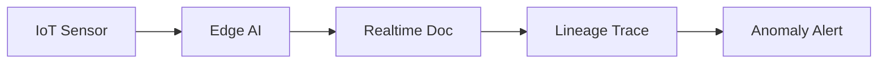
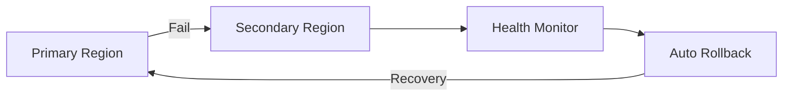

# E29: 物联网数据管道+多云容灾+内容运营全链路 E2E 测试模式 (2026-07-08)

> 专家: E29 · Pulse-Nightly-10 凌晨测试 · 跨模块 E2E 模式

---

## 概述
Pulse-Nightly-10 新增 3 条跨模块 E2E 测试链（链29-31），覆盖三大全新业务领域：物联网数据管道、多云区域容灾、内容运营全链路。新增 62 个 subtests，全部通过。至此跨模块 E2E 链总数达 31 条。

## 核心洞察

### 1. 物联网数据管道 E2E 测试模式
**链29**: IoT → Edge AI → Realtime Collaboration → Lineage

**设计考虑**:
- IoT 设备数据上报需覆盖在线/离线/异常三种状态
- Edge AI 推理需验证正常值、异常值、极值三种输入
- Lineage 血缘追踪需支持上游/下游双向追踪 + 深度限制
- 全链路需验证 IoT→Edge→Realtime→Lineage 完整数据流

**典型测试三元组**:
- 正例: 正常温度 → Edge推理正常 → 创建协同文档 → 血缘可溯源
- 反例: 无效deviceId → 拒绝; 空推理输入 → 拒绝
- 边界: 极值温度 → 检测为异常 → 告警文档创建 → 血缘关联

### 2. 多云区域容灾 E2E 测试模式
**链30**: MultiRegion → HealthCheck → AutoRollback

**设计考虑**:
- 区域路由需测试主→备切换、备恢复→主切换、全部故障→503
- 健康检查需覆盖 healthy/degraded/down/unknown 四种状态
- 自动回滚需验证健康部署→成功、失败部署→自动回滚、部署幂等性
- 全链路集成: 故障→切换→健康检查→部署→回滚→恢复

**容灾测试关键场景**:
1. 主区域故障 → 请求路由到备区域 ✅
2. 备区域也故障 → 服务的下一优先级区域 ✅
3. 全部故障 → 503 Service Unavailable ✅
4. 手动触发主从切换 → 确认优先级正确 ✅
5. 降级区域恢复 → 自动切回最高优先级 ✅

### 3. 内容运营全链路 E2E 测试模式
**链31**: Content → BrandCustom → I18n → Multimedia

**设计考虑**:
- 内容管理需验证 CRUD + 版本控制（创建/读取/更新/版本递增）
- 品牌模板需验证创建/查询/缺失品牌名拒绝
- 国际化需验证多语言翻译、占位符保留、不支持locale警告
- 多媒体需验证上传/查询/适配/超大文件拒绝
- 全链路验证: 创建内容→应用模板→翻译→嵌入媒体→发布

**国际化测试要点**:
- 占位符 `{name}` `{orderId}` 必须在翻译结果中保留
- 不支持的 locale 应返回警告而非崩溃
- 至少覆盖 6 个亚太主要市场 locale

## 角色视角扩展
本次新增 3 个角色视角:
| 角色 | 对应链 | 验证场景 |
|------|:------:|---------|
| IoT Operator | 29 | 设备数据监控、传感器管理 |
| SRE/DevOps | 30 | 区域容灾、健康监测、部署回滚 |
| Content Manager | 31 | 内容创建、品牌模板、多语言翻译 |

## 持续关注事项
1. 内联 domain 模拟 vs 真实 NestJS 模块集成: 链29-31 的 domain 模拟层待升级为真实模块
2. @m5/api full-regression 报告器 false positive: 需适配 Vitest 4
3. 内容审核工作流: 链31 缺少"审核→驳回→重新提交→发布"审批流
4. @m5/api P0-007 超时 + P0-009 TSC 73 errors 仍持续
